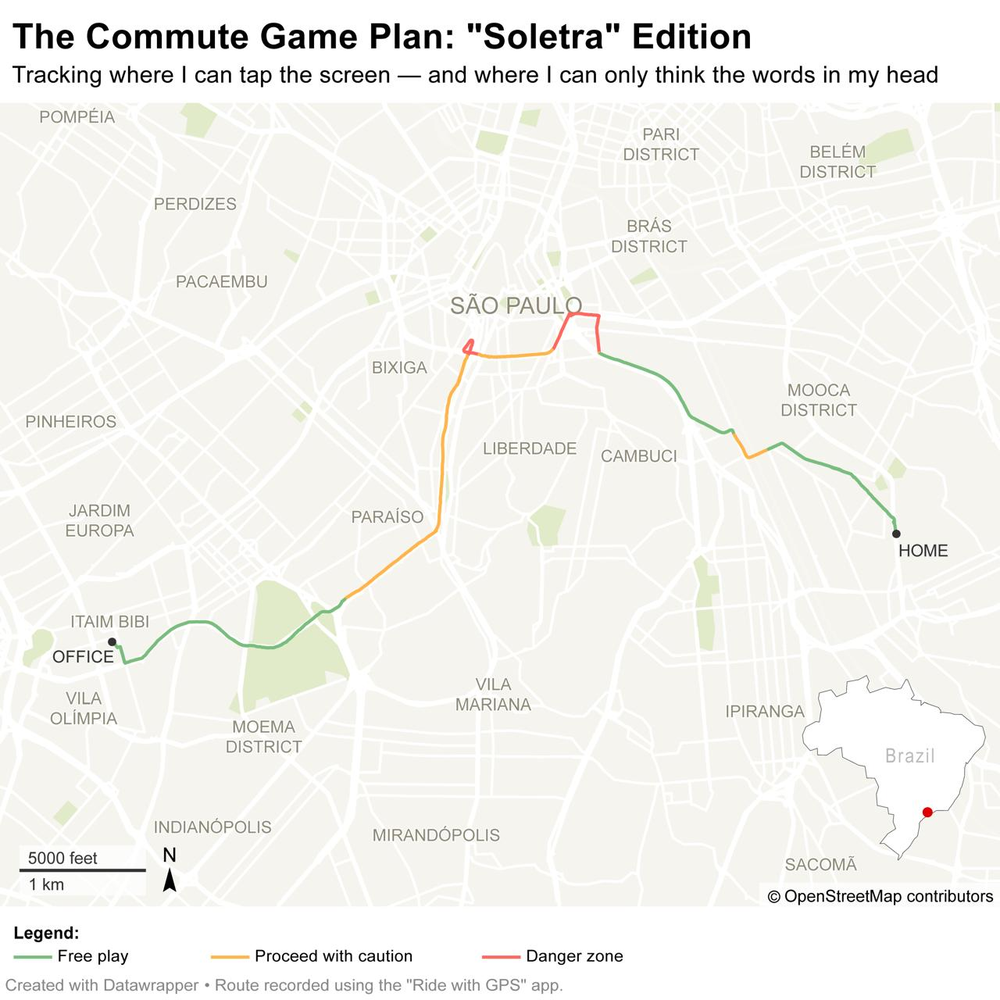

# [The Commute Game Plan: "Soletra" Edition](https://giovannacbs.github.io/Lede-Project-1/)
An interactive scrollytelling project built to visualize cellphone theft risk along my daily commute in São Paulo.
---

## 📍 Workflow Summary

1. **Route Mapping**
   - Tracked my daily route using the **Ride with GPS** app.
   - Imported the route into **Datawrapper** to generate a clean map base.
   - Exported the map from Datawrapper as **SVG** and opened it in **Adobe Illustrator**.
   - Manually color-coded route segments based on perceived risk.

    

2. **Crime Data Processing**
   - Downloaded cellphone robbery data from the [SSP-SP Portal](https://www.ssp.sp.gov.br/Estatistica/Consulta.aspx) for the year 2025 (up to April).  
   - The dataset includes only **reported cases of cellphones subtracted by theft or robbery**.
   - Cleaned and processed the data using **Python** (`pandas`, `geopandas`).
   - Imported the cleaned data into **QGIS**, categorized incidents (e.g. thefts in transports), and applied color-coded layers.
   - Exported the final map layer as **SVG** for visual integration.

5. **Map Composition**
   - Combined route and crime layers in **Adobe Illustrator**.
   - Finalized design elements and annotations.

6. **Interactive Scrollytelling**
   - Built the site using **HTML, CSS, D3.js**, and **Scrollama.js**.
   - Used step-based scroll triggers to update visuals.

## 🛠️ Tools Used

- Ride with GPS  
- Adobe Illustrator  
- Python (pandas, geopandas)  
- QGIS  
- HTML/CSS  
- D3.js  
- Scrollama.js

